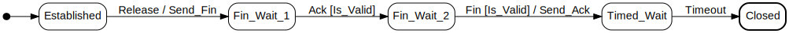

# SML

Declarative, low-overhead **state machines for Ada**, inspired by
[boost-ext/sml](https://github.com/boost-ext/sml). The goal is to describe a
machine as a table you can read top-to-bottom — the way a UML state chart reads —
while keeping the engine small, fast, and provable.

The example (`example/hello_world.adb`, a port of Boost.SML's TCP-teardown
example) is exactly this diagram:



```ada
--  Each row reads:  From + Event (Guard) / Action >= To
Table : constant Transition_Table :=
  [Established + Release            / Send_Fin >= Fin_Wait_1,
   Fin_Wait_1  + Ack     (Is_Valid)            >= Fin_Wait_2,
   Fin_Wait_2  + Fin     (Is_Valid) / Send_Ack >= Timed_Wait,
   Timed_Wait  + Timeout                       >= Closed];
```

## Why this design

You can't reproduce Boost.SML's `src + event[guard] / action = dst` operator DSL
exactly in Ada (`=` must return `Boolean`, there is no user-definable `[]`, and
operator symbols are a fixed set) — but `Sml.Machines.Operators` gets close
with `+`, `(...)`, `/` and `>=`, because the *at-a-glance* quality of SML lives in the
row layout, not the exact operators. States and events are enumeration types,
transitions are a flat array (one row each), and guards and actions are **named**
rather than stored as subprogram pointers. Naming them keeps the table pure
data, lets the compiler inline the dispatch, makes the `case` arms
exhaustiveness-checked, and keeps the engine provable with SPARK.

`Sml.Machines` is the engine; `Sml.Machines.Operators` is the opt-in
operator layer that produces the rows above. The core operation is
`Process_Event` (matching Boost.SML's `process_event`).

## Operator notation

Instantiate the `Sml.Machines.Operators` child on your `Machines` instance,
naming the "always" guard and "do nothing" action used by rows that omit them:

```ada
package SM is new Sml.Machines (...);
package Op is new SM.Operators (Always => Always, Nothing => Nothing);
use SM, Op;

Release : constant Ev := (Kind => E_Release);   --  one wrapper per event
--  Ack, Fin, Timeout : likewise
```

A row built this way is just a `Transition`, so the table is an ordinary array
aggregate fed to the usual `Make` — no special container, and it stays in the
SPARK subset. (The engine also accepts plain tuple rows
`(Established, Release, Always, Send_Fin, Fin_Wait_1)` without these operators —
that's what the tests use.) Costs: a wrapper constant per event (its name
must differ from the `Event_Kind` literal, hence the `E_*` prefix), and `>=`
rather than SML's `=` for the target. The initial state is given to `Make`
(SML's `*`); a state with no outgoing row is terminal (SML's `X`).

### Guards & actions

`Guard_Kind` and `Action_Kind` are your own enumerations; you supply one
`Evaluate` and one `Execute` dispatcher mapping a name to its behaviour:

```ada
function Evaluate (G : Guard_Kind; Ctx : Context; Evt : Event) return Boolean is
  (case G is
      when Always   => True,
      when Is_Valid => ...);

procedure Execute (A : Action_Kind; Ctx : in out Context; Evt : Event);
```

`Context` is your *extended state* — whatever the guards read and the actions
modify (a counter, a buffer, …). Guards are read-only (`Ctx` is `in`); actions
may modify it (`in out`).

### Events with payloads

Events are a variant record; `Kind_Of` extracts the discrete tag the table
matches on:

```ada
type Event (Kind : Event_Kind := E_Timeout) is record
   case Kind is
      when E_Ack  => Ack_Valid : Boolean;
      when E_Fin  => Id : Integer; Fin_Valid : Boolean;
      when others => null;
   end case;
end record;
```

### Completeness & unhandled events

`Make` takes two policy knobs:

- `Complete => Total` makes `Make` reject a table that doesn't cover every
  `(State, Event_Kind)` (raising `Incomplete_Table`); `Partial` (default) allows
  gaps.
- `On_Unhandled` decides what `Process_Event` does when no row matches: `Stay`
  (default), `Raise_Error`, or `Go_To_Default`.

### Tracing

Instantiate with `Debug => True` and a `Trace` procedure to log, for every
event: the event kind, the current state, each guard tried and its result, the
action, and the resulting state. The trace calls route through one `Debug`-gated
`Log` sink, so `Debug => False` (the default) is silent. The messages are built
at the call site and discarded when tracing is off; an optimized build
(`-O2`/`-O3`) inlines the no-op `Log` and folds that string-building away to
nothing, so disabled tracing costs nothing in release. Build the example with
tracing on to see it:

```console
$ alr exec -- gprbuild -XTRACE=on -P example/example.gpr && ./example/bin/hello_world
start: ESTABLISHED
[trace]event E_RELEASE in state ESTABLISHED
[trace]  guard ALWAYS => TRUE
[trace]  action SEND_FIN; ESTABLISHED -> FIN_WAIT_1
send: fin
...
final: CLOSED
```

### Formal verification (SPARK)

The engine is written in the SPARK subset. `proof/` instantiates the engine and
its operators for a turnstile and `gnatprove` verifies it: `Process_Event` is proved free of
run-time errors, and `Make`'s contract (`State_Of (Make'Result) = Initial`)
holds (`gnatprove` only analyses a generic through a concrete instance). `Make`'s
body is excluded from proof because its `Total`-completeness check raises
`Incomplete_Table` by design — that raise is part of its contract for callers.

## Generating an optimized machine

The table engine scans the transition table on every event — O(n) in the number
of transitions — and stores the table in each `Machine`. For hot paths you can
instead **generate** a specialized machine from a terse spec. The generator
(`example/generated/generate.adb`) reads a text spec and emits the enums and a
self-contained machine whose `Process_Event` is a `case` on the current state.

The spec (`example/generated/hello_world.fsm`) is the whole machine, written in
the **same operator notation as the engine's Ada table** — so migrating from the
engine version is copy-paste (the aggregate's `[`, commas and `];` are tolerated):

```
Initial => Established

Established + Release            / Send_Fin >= Fin_Wait_1
Fin_Wait_1  + Ack     (Is_Valid)            >= Fin_Wait_2
Fin_Wait_2  + Fin     (Is_Valid) / Send_Ack >= Timed_Wait
Timed_Wait  + Timeout                       >= Closed
```

and the generated `Process_Event` is:

```ada
case M.Current is
   when Established =>
      if Evt.Kind = Release then
         Send_Fin (Ctx, Evt);
         M.Current := Fin_Wait_1;
         return;
      end if;
   --  ... one arm per state ...
end case;
```

### Why generate

- **O(1) dispatch instead of O(n).** The `case` on the current state compiles to
  a jump table, so an event goes straight to its state's arm rather than scanning
  the whole table. No table, no scan, no indirect calls, and a `Machine` is one
  enum.
- **It dissolves to nothing for a fixed event sequence.** The generated machine
  is marked `Inline`, so a whole-program driver that feeds compile-time-known
  events constant-folds the entire machine away. `example/generated/run.adb`
  mirrors Boost.SML's `main` — a baked sequence with a `pragma Assert` on each
  resulting state (`assert(sm.is(...))` in C++):

  ```ada
  M : Machine := Make;                                  --  Established
  Process_Event (M, Ctx, (Kind => Release));
  pragma Assert (State_Of (M) = Fin_Wait_1);
  Process_Event (M, Ctx, (Kind => Ack, Ack_Valid => True));
  pragma Assert (State_Of (M) = Fin_Wait_2);
  --  ... Fin, Timeout ...
  ```

  Built at `-O3 -gnatn` (cross-unit inlining), `_ada_run` reduces to just the
  action side effects — `Process_Event`, the guards, the state and even the
  asserts (proven true) all gone:

  ```asm
  _ada_run:
      lea    rdi, ["send: fin"]
      call   ada__text_io__put_line
      lea    rdi, ["send: ack"]
      jmp    ada__text_io__put_line     ; tail call
  ```

  That is the same shape as the optimized Boost.SML `main` (two `printf`s) — the
  compiler does the dissolving, here as in C++ (C++ gets it for free because it's
  header-only one-TU; Ada needs `pragma Inline` + `-gnatn` to inline across units).
- **Much less boilerplate.** From the spec, the generator derives the
  `State`/`Event_Kind` enums and writes `Make`, `State_Of`, `Process_Event`, and
  a Graphviz diagram. The machine calls each guard/action **by name**, so the
  only hand-written Ada is the parts no table can imply — `hello_world_logic`
  (event payloads, `Context`, one inlinable subprogram per guard/action) — plus
  the driver. A parser, not an Ada value, is the source of truth, which is what
  lets the enums be generated too.

### How to generate and build the binary

The generated example lives in `example/generated/`. The generated sources are
**not** committed — producing them is the whole point — so it is a two-phase
build: run the generator, then compile the driver against what it emitted (the
`.gpr` already sets `-O3 -gnatn` so it dissolves as above).

```console
# 1. generate the enums + machine + diagram from the spec
alr exec -- gprbuild -P example/generated/generated.gpr generate.adb
(cd example/generated && bin/generate)

# 2. build & run the whole-program driver
alr exec -- gprbuild -P example/generated/generated.gpr run.adb
./example/generated/bin/run        # send: fin / send: ack
```

You hand-write `hello_world.fsm` (the spec), the `hello_world_logic` package
(`.ads` + `.adb`: the `Event` payloads, the `Context`, and one inlinable
subprogram per guard/action), and `run.adb` (the driver, mirroring Boost.SML's
`main`). The generator emits the enums and the inlinable machine. Re-run step 1
whenever `hello_world.fsm` changes.

## Building, testing, proving, formatting

```console
alr build                                   # build the library
alr test                                    # build + run the AUnit suite
alr exec -- gnatprove -P proof/proof.gpr    # run the SPARK proof
alr exec -- gprbuild -P example/example.gpr && ./example/bin/hello_world
gnatformat --check src/*.ad? tests/src/*.ad? example/src/*.ad? proof/src/*.ad?
```

Transition tables are wrapped in `--!format off`/`--!format on` so `gnatformat`
keeps their hand-aligned columns.

## Layout

```
src/      sml.ads, sml-machines.{ads,adb}, sml-machines-operators.ads
tests/    AUnit suite (test_sml.gpr)
proof/    SPARK proof target (proof.gpr)
example/  hello_world.adb + TRACE on/off config (example.gpr)
example/generated/  hello_world.fsm spec + generate.adb + hand-written logic;
          generates a self-contained machine (generated.gpr)
docs/     hello_world.dot/.svg (state diagram)
```

## Requirements

GNAT + `gprbuild` (via Alire); the crate compiles as **Ada 2022**. The test
suite needs `aunit`; the proof needs `gnatprove`. The diagram in `docs/` is
rendered with Graphviz (`dot`).
